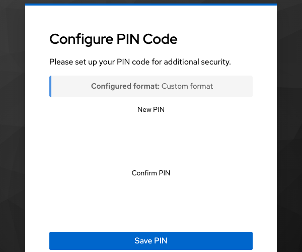
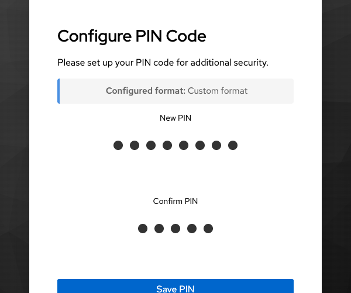
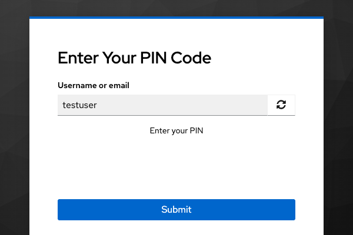
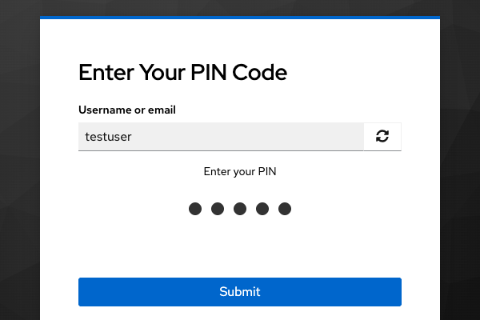

# Keycloak PIN Code Authenticator

A Keycloak extension that adds PIN code authentication as an additional factor. Supports numeric and custom formats, server-side visual keyboard with OCR obfuscation, Argon2 hashing with transparent algorithm migration, and admin-triggered PIN reset via email.

[](https://opensource.org/licenses/Apache-2.0)
[](https://www.java.com)
[](https://www.keycloak.org)

---

## Quickstart

### From a GitHub release

1. Download the latest JAR from [Releases](https://github.com/keycloak-extensions/pin-code-authenticator/releases).
2. Copy it into your Keycloak `providers/` directory:
   ```bash
   cp keycloak-pin-authenticator-*.jar /opt/keycloak/providers/
   ```
3. Restart Keycloak (or run `kc.sh build` for optimized mode).
4. In the admin console, go to **Authentication > Flows**, create or edit a flow, and add the **PIN Code Authenticator** execution.
5. Go to **Authentication > Required Actions**, enable **Configure PIN Code**, and optionally set it as a default action for new users.

### With Docker Compose (local dev)

```bash
git clone https://github.com/keycloak-extensions/pin-code-authenticator.git
cd pin-code-authenticator
mvn clean package
docker compose up -d
```

Keycloak is available at `http://localhost:8080` (admin / admin).  
A pre-configured `pin-test` realm with a test user (`testuser` / `password123`) is imported automatically.

---

## Screenshots

| Configure PIN (empty) | Configure PIN (typing) |
|---|---|
|  |  |

| Authenticate (empty) | Authenticate (typing) |
|---|---|
|  |  |

---

## Configuration

All settings are provided via Keycloak's native `Config.Scope` mechanism, either as environment variables or in `keycloak.conf`.

### Per-instance settings (authenticator config)

These are set on each PIN authenticator execution inside a flow (gear icon in the admin console):

| Setting | Description | Default |
|---|---|---|
| `pin.resetEnabled` | Show a "Reset PIN credential?" link on the PIN authenticator page | `false` |
| `pin.requiredAction` | Require new users to configure a PIN on first login | `false` |
| `maxAttempts` | Max PIN attempts before lockout (0 = unlimited) | `3` |

### Global settings (environment variables)

| Variable | Description | Default |
|---|---|---|
| `KC_SPI_AUTHENTICATOR__PIN_AUTHENTICATOR__PIN_FORMAT` | `4-digits`, `6-digits`, `8-digits`, or `custom` | `4-digits` |
| `KC_SPI_AUTHENTICATOR__PIN_AUTHENTICATOR__PIN_CUSTOM_REGEX` | Regex when format is `custom` (e.g. `[\w]{8}`) | _(empty)_ |
| `KC_SPI_AUTHENTICATOR__PIN_AUTHENTICATOR__VISUAL_KEYBOARD_ENABLED` | Show a server-side visual keyboard for PIN entry | `false` |
| `KC_SPI_AUTHENTICATOR__PIN_AUTHENTICATOR__VISUAL_KEYBOARD_DEBUG` | Log digit-coordinate mappings to server logs (dev only) | `false` |
| `KC_SPI_AUTHENTICATOR__PIN_AUTHENTICATOR__VISUAL_KEYBOARD_OBFUSCATION` | Apply OCR-resistant obfuscation to digit rendering | `true` |

> **Note:** double underscore `__` separates scope levels (`authenticator` > `pin-authenticator` > property).

### keycloak.conf equivalent

```properties
spi-authenticator-pin-authenticator-pin-format=6-digits
spi-authenticator-pin-authenticator-visual-keyboard-enabled=true
spi-authenticator-pin-authenticator-visual-keyboard-debug=false
spi-authenticator-pin-authenticator-visual-keyboard-obfuscation=true
spi-authenticator-pin-authenticator-pin-custom-regex=
```

### Docker Compose example

```yaml
environment:
  KC_SPI_AUTHENTICATOR__PIN_AUTHENTICATOR__PIN_FORMAT: "6-digits"
  KC_SPI_AUTHENTICATOR__PIN_AUTHENTICATOR__PIN_CUSTOM_REGEX: ""
  KC_SPI_AUTHENTICATOR__PIN_AUTHENTICATOR__VISUAL_KEYBOARD_ENABLED: "false"
  KC_SPI_AUTHENTICATOR__PIN_AUTHENTICATOR__VISUAL_KEYBOARD_OBFUSCATION: "true"
```

---

## Advanced usage

### PIN formats

| Format | Input | Regex |
|---|---|---|
| `4-digits` | Numeric only | `^\d{4}$` |
| `6-digits` | Numeric only | `^\d{6}$` |
| `8-digits` | Numeric only | `^\d{8}$` |
| `custom` | Anything matching the configured regex | User-provided |

For numeric formats the UI renders a fixed number of placeholder dots; for the `custom` format, dots are added dynamically as the user types (no grey placeholders).

### Visual keyboard

When `VISUAL_KEYBOARD_ENABLED` is `true`, a server-side rendered virtual keyboard replaces the standard text input on both the PIN authenticator and Configure PIN pages. The keyboard is a **PNG image generated entirely on the server** using `java.awt.Graphics2D`.

#### Architecture

1. **Server generates a 400×320 PNG image** with digits 0–9 placed at random non-overlapping positions (randomized on every page load).
2. The server stores the digit-to-coordinate mapping in the Keycloak **authentication session notes** (never sent to the client).
3. The client displays the image and records **click coordinates** (e.g. `189,78|184,247`) in a hidden form field.
4. On form submission, the server **resolves coordinates back to digits** by matching click points against the stored coordinate map.

This means:
- **No digit values are ever transmitted** from client to server — only pixel coordinates.
- The coordinate-to-digit mapping exists only in the server's session state.
- Each page load generates a fresh random layout, preventing replay attacks.
- A screen-captured keyboard image is useless without the server-side mapping.

#### OCR obfuscation

When `VISUAL_KEYBOARD_OBFUSCATION` is `true` (the default), digits are rendered with visual noise to resist automated screen capture + OCR attacks:

- Random rotation (±15°) per digit
- Random scale variation (85%–115%)
- Noise lines drawn across each digit cell
- Variable stroke widths
- Randomized sub-pixel offsets

Set it to `false` for clean rendering during development/testing.

#### Debug mode

When `VISUAL_KEYBOARD_DEBUG` is `true`, the server logs the coordinate map for each generated keyboard to Keycloak's standard log output (prefixed with `[VISUAL-KB-DEBUG]`). This is used by E2E tests to know where digits are placed. **Never enable in production.**

#### Font requirements (Docker)

The `java.awt.Graphics2D` rendering pipeline requires system fonts and the native `fontconfig` library. The default Keycloak Docker image (RHEL UBI 9 minimal) does **not** include these. The provided [docker/Dockerfile](docker/Dockerfile) adds fonts via a multi-stage build:

```dockerfile
FROM registry.access.redhat.com/ubi9/ubi-minimal:latest AS font-builder
RUN microdnf install -y fontconfig dejavu-sans-fonts && fc-cache -f

FROM quay.io/keycloak/keycloak:26.5.3
COPY --from=font-builder /usr/share/fonts /usr/share/fonts
COPY --from=font-builder /usr/share/fontconfig /usr/share/fontconfig
COPY --from=font-builder /etc/fonts /etc/fonts
COPY --from=font-builder /var/cache/fontconfig /var/cache/fontconfig
# + required shared libraries (libfontconfig, libfreetype, etc.)
```

If you use a full Linux distribution as your base image (e.g. `ubi9/ubi` instead of `ubi9/ubi-minimal`), fonts are typically already available.

### Conditional authenticator

A conditional authenticator (`pin-conditional`) is included. It lets you skip the PIN step for users who have not yet configured a PIN, making the flow work for both PIN-enrolled and non-enrolled users in the same authentication flow.

### PIN reset (user-initiated)

When enabled, a **"Reset PIN credential?"** link appears on the PIN authenticator page. Clicking it triggers the following flow:

1. Keycloak sends a **reset email** with a time-limited action-token link (valid 12 hours).
2. The user clicks the link, which deletes the old PIN and opens the **Configure PIN** required action.
3. The user configures a new PIN and is redirected back to the application.

#### Enabling the reset link

In the Keycloak admin console:

1. Go to **Authentication > Flows**, select the flow containing the PIN authenticator.
2. Click the gear icon on the **PIN Code** execution.
3. Set **pin.resetEnabled** to `true`.

Or via `kcadm` CLI:

```bash
kcadm.sh update authentication/config/<config-id> -r <realm> \
  -s 'config."pin.resetEnabled"=true'
```

> **Note:** The realm must have SMTP configured for email delivery.

### PIN reset (admin endpoint)

An admin can trigger a PIN reset for any user by calling the REST endpoint.
The caller must have the `admin` realm role in the **target realm** (not the master realm).

```bash
# Using a service account in the target realm
TOKEN=$(curl -s -X POST "http://localhost:8080/realms/<realm>/protocol/openid-connect/token" \
  -d "client_id=<service-client-id>" \
  -d "client_secret=<service-client-secret>" \
  -d "grant_type=client_credentials" | jq -r .access_token)

# Trigger PIN reset — deletes the old PIN, adds CONFIGURE_PIN required action,
# and sends an action-token email to the user
curl -X POST "http://localhost:8080/realms/<realm>/pin-reset" \
  -H "Authorization: Bearer $TOKEN" \
  -H "Content-Type: application/json" \
  -d '{"username": "testuser"}'
```

The endpoint accepts either `{"username": "..."}` or `{"userId": "..."}`.
Returns `204 No Content` on success.

### Argon2 hashing and algorithm migration

PINs are hashed with **Argon2id**, using the same defaults as Keycloak uses for passwords:

| Parameter | Value |
|---|---|
| Type | Argon2id |
| Version | 1.3 |
| Memory | 7 168 KB |
| Iterations | 5 |
| Parallelism | 1 |
| Hash length | 32 bytes |
| Salt length | 16 bytes |

If you upgrade from an older version that used SHA-256, existing credentials are verified with SHA-256 and **transparently re-hashed to Argon2** on the user's next successful login. No manual migration is needed.

---

## Build and implementation details

### Prerequisites

- Java 21
- Maven 3.6+
- Docker & Docker Compose (for local testing)
- Node.js 18+ and Puppeteer (for E2E tests)

### Build

```bash
mvn clean package        # compile + unit tests + JAR
```

The output JAR is `target/keycloak-pin-authenticator-1.0.0-SNAPSHOT.jar`.

### Project structure

```
src/main/java/it/pleaseopen/keycloak/extensions/pin/
  authenticator/          Authenticator + ConditionalAuthenticator + factories
  action/                 ConfigurePinAction (Required Action)
  config/                 PinConfiguration singleton (reads Config.Scope)
  credential/             PinCredentialProvider, PinCredentialModel,
                          PinHashProvider interface, Argon2PinHashProvider,
                          Sha256PinHashProvider (legacy), constants
  keyboard/               KeyboardImageGenerator (server-side visual keyboard)
  rest/                   PinResetResource (RealmResourceProvider endpoint)
  token/                  ResetPinActionToken + handler (email reset flow)

src/main/resources/
  META-INF/services/      SPI registration files
  theme-resources/
    templates/             FreeMarker templates (configure-pin, pin-authenticator)
    messages/              i18n message bundles
```

### Keycloak SPIs implemented

| SPI | Provider ID | Class |
|---|---|---|
| `authenticator` | `pin-authenticator` | `PinAuthenticatorFactory` |
| `authenticator` | `pin-conditional` | `PinConditionalAuthenticatorFactory` |
| `required-action` | `CONFIGURE_PIN` | `ConfigurePinActionFactory` |
| `credential` | `pin-credential-provider` | `PinCredentialProviderFactory` |
| `realm-restapi-extension` | `pin-reset` | `PinResetResourceProviderFactory` |
| `action-token-handler` | `reset-pin` | `ResetPinActionTokenHandler` |

### Testing

#### Unit tests (JUnit 5 + AssertJ)

```bash
mvn test
```

119 tests covering credential model, hash providers (Argon2 + SHA-256), format validation, factory metadata, constants, action token, token handler, REST resource factory, and keyboard image generation (36 tests).

#### End-to-end tests (Puppeteer)

```bash
npm install          # first time only
node e2e/test-pin-flow.js
node e2e/test-pin-reset.js
```

`e2e/test-pin-flow.js` — 6 tests: PIN configuration (custom format), authentication, wrong PIN rejection, mismatch rejection, invalid format rejection, and dynamic dot visual feedback.

`e2e/test-pin-reset.js` — 4 tests: reset link visibility (enabled/disabled), full email reset flow via Mailpit, and admin REST API endpoint.

#### Visual keyboard E2E tests

```bash
# Start Keycloak with visual keyboard enabled
docker compose -f docker-compose.yml -f docker-compose.visual-kb.yml up -d --force-recreate keycloak

# Run the tests
node e2e/test-visual-keyboard.js
```

`e2e/test-visual-keyboard.js` — 8 tests: server-generated PNG verification, HTML button controls, debug coordinate logging, coordinate field population, backspace/clear functionality, full configure-PIN flow via clicks, authentication via visual keyboard (LOA 2), and wrong-PIN rejection.

All E2E tests are located in the `e2e/` directory. Run with `--headed` to watch the browser, or `--test N` to run a single test.

---

## License

Copyright 2026 Pin Code Authenticator Contributors.

Licensed under the Apache License, Version 2.0. See [LICENSE](LICENSE) for the full text.

**This software is provided "AS IS", WITHOUT WARRANTIES OR CONDITIONS OF ANY KIND, either express or implied.** See the License for the specific language governing permissions and limitations.
